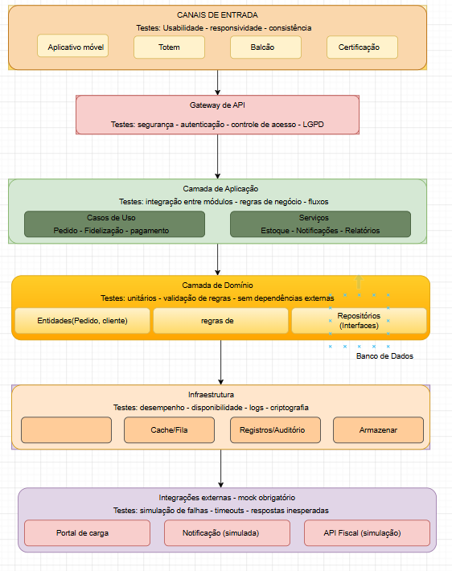
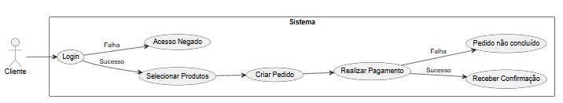

# UNINTER — CENTRO UNIVERSITÁRIO INTERNACIONAL
Curso de Análise e Desenvolvimento de Sistemas

PROJETO MULTIDISCIPLINAR  
Trilha: Qualidade de Software

## Documento Acadêmico Oficial

- O trabalho  completo pode ser acessado no arquivo abaixo:
[TRABALHO.QA.LUCAS.pdf](https://github.com/user-attachments/files/28647713/TRABALHO.QA.LUCAS.pdf)

# Rede "Raízes do Nordeste"

---

## Sumário

1. [Introdução e Objetivos](#1-introdução-e-objetivos)
2. [Análise de Qualidade de Software e Escopo](#2-análise-de-qualidade-de-software-e-escopo)
3. [Planejamento de Garantia da Qualidade (QA Plan)](#3-planejamento-de-garantia-da-qualidade-qa-plan)
4. [Arquitetura da Solução e Qualidade](#4-arquitetura-da-solução-e-qualidade)
5. [Testes de Software](#5-testes-de-software)
6. [Métricas e Indicadores de Qualidade](#6-métricas-e-indicadores-de-qualidade)
7. [LGPD e Privacidade](#7-lgpd-e-privacidade)
8. [Conclusão](#8-conclusão)
9. [Referências](#9-referências)

---

## 1. Introdução e Objetivos

### 1.1 Contexto do Estudo de Caso

A Rede “Raízes do Nordeste” é uma empresa em expansão no segmento de lanchonetes, fundada em Recife com o propósito de levar a culinária nordestina ao cotidiano urbano, aliando qualidade, agilidade e valorização da identidade cultural.

Com o crescimento da operação, a rede passou a atuar em múltiplos canais de atendimento incluindo aplicativo, totens de autoatendimento, atendimento presencial e retirada rápida, o que exige padronização da experiência do cliente e maior controle sobre os processos operacionais.

Cada unidade possui autonomia na gestão de equipe, estoque e metas, enquanto a franqueadora acompanha, em tempo real, indicadores estratégicos como vendas, desempenho por unidade, produtos mais consumidos e operações financeiras sensíveis.

Adicionalmente, a empresa implementou um programa de fidelização de clientes e realiza integrações com serviços de pagamento externos, o que exige atenção à segurança da informação, à conformidade com a LGPD e ao tratamento adequado de dados pessoais.

---

### 1.2 Objetivo do Trabalho

Este trabalho tem como objetivo estruturar uma estratégia completa de Garantia da Qualidade de Software para o sistema digital integrado da Rede Raízes do Nordeste, com foco em suportar uma operação escalável, padronizada e orientada à experiência do cliente.

A proposta busca não apenas validar o funcionamento do sistema, mas garantir que ele atenda aos requisitos de negócio, oferecendo confiabilidade, segurança e desempenho adequados para um ambiente real de franquias.

O focoé aplicar, na prática, conceitos de Engenharia de Requisitos e Garantia da Qualidade de Software. Para isso, serão realizadas atividades como o levantamento e definição dos requisitos (funcionais e não funcionais), a criação de critérios de aceitação claros, o planejamento dos testes em diferentes níveis, além da definição de métricas e indicadores de qualidade.

Também são considerados pontos importantes como a análise de riscos, a adequação à LGPD (Lei Geral de Proteção de Dados Pessoais) e a organização da rastreabilidade entre requisitos, testes e evidências, garantindo maior controle sobre todo o processo.

Ao final, a ideia é contribuir para que o sistema apresente atributos essenciais, como confiabilidade, desempenho, segurança, usabilidade, escalabilidade e facilidade de manutenção, seguindo uma abordagem mais organizada e preventiva em relação à qualidade.

---

### 1.3 Principais Usuários do Sistema

O sistema da Rede Raízes do Nordeste é utilizado por diferentes
tipos de usuários, cada um com um papel dentro da operação:

- **Cliente final:** utiliza o aplicativo, totem, balcão ou
  pick-up para fazer pedidos, acompanhar o status, acumular
  pontos e usar benefícios do programa de fidelização;
- **Atendente de balcão:** registra os pedidos dos clientes
  presencialmente e ajuda no fluxo de atendimento da unidade;
- **Gerente de unidade:** acompanha o estoque, o desempenho da
  equipe, cancelamentos e os principais indicadores da loja;
- **Gestor da matriz (franqueadora):** acessa relatórios gerais
  da rede, como vendas, desempenho financeiro e operações mais
  sensíveis;
- **Equipe de TI / QA:** responsável por garantir que o sistema
  funcione corretamente, com qualidade, segurança e estabilidade.

---

### 1.4 Relevância do Sistema

O sistema da Rede Raízes do Nordeste é essencial para o
funcionamento do negócio no dia a dia. Ele está diretamente
ligado ao atendimento dos clientes, ao controle das operações e
ao faturamento das unidades.

Em momentos de maior movimento, como horários de pico, o sistema
precisa ser rápido e estável. Qualquer falha pode gerar filas,
atrasos, perda de vendas e insatisfação dos clientes.

Além disso, como o sistema envolve dados pessoais e integrações
com pagamentos, é fundamental garantir segurança e confiabilidade
no uso dessas informações.

Por isso, investir em qualidade não é apenas uma questão técnica,
mas uma necessidade para o negócio. Um sistema bem testado e
confiável contribui para uma melhor experiência do cliente e
para o crescimento da rede de forma segura.

---

## 2. Análise de Qualidade de Software e Escopo

### 2.1 Análise de Qualidade de Software

O sistema da Rede Raízes do Nordeste funciona em um cenário de
múltiplos canais de atendimento e integração entre diferentes
partes, o que aumenta a complexidade e exige mais cuidado com a
qualidade.

Um dos principais pontos de atenção é que o sistema será usado
de várias formas: aplicativo, totem, balcão e retirada rápida.
Por isso, é importante garantir que o cliente tenha uma boa
experiência em qualquer um desses canais.

Outro ponto importante é o uso em horários de pico. Nesses
momentos, o sistema precisa continuar rápido e estável, já que
qualquer lentidão pode gerar filas e impactar diretamente o
atendimento.

Também existe a dependência de serviços externos, como o
pagamento. Se algo falhar nessa integração, o sistema precisa
saber lidar com isso sem prejudicar o pedido do cliente.

A questão da segurança também é essencial, principalmente por
envolver dados pessoais dos usuários. Por isso, é necessário
seguir as regras da LGPD, garantindo que essas informações sejam
tratadas de forma correta e segura.

Além disso, cada unidade da rede pode ter diferenças, como
produtos disponíveis ou forma de operação. Mesmo assim, o sistema
precisa manter um padrão para o cliente, independentemente da
unidade.

Diante disso, fica claro que é necessário um bom planejamento de
qualidade, focado em evitar problemas, testar bem o sistema e
reduzir riscos.

---

### 2.2 Escopo do Projeto

Este projeto tem como foco a parte de Garantia da Qualidade de
Software para o sistema da Rede Raízes do Nordeste, priorizando
a confiabilidade operacional, a experiência do usuário, a
segurança da informação, o desempenho e a escalabilidade da
solução.

Serão trabalhadas atividades como levantamento de requisitos,
definição de critérios de aceitação, planejamento de testes,
criação de cenários e definição de métricas, sempre com o
objetivo de garantir que o sistema funcione bem e atenda às
necessidades.

O foco está na visão de QA — na qualidade do sistema — e não no
desenvolvimento completo da aplicação.

---

### 2.3 Contexto do Sistema e Problema a Resolver

O sistema da Rede Raízes do Nordeste está inserido em um modelo
de franquias, onde diferentes unidades operam de forma
independente, mas precisam manter um padrão definido pela
franqueadora.

Cada unidade pode apresentar diferenças na sua operação, como
estrutura da cozinha, disponibilidade de produtos ou variações
sazonais no cardápio. Mesmo assim, o cliente espera ter uma
experiência semelhante em qualquer unidade da rede.

Além disso, o sistema precisa atender múltiplos canais, o que
aumenta a complexidade do funcionamento.

O principal desafio é garantir que o sistema funcione de forma
consistente, segura e eficiente em todos os contextos, mesmo com
variações entre unidades e alto volume de uso em determinados
horários. Também é necessário lidar com integrações externas e
garantir o tratamento adequado dos dados dos usuários conforme
a LGPD.

---

### 2.4 Requisitos Funcionais

Os requisitos funcionais representam as principais
funcionalidades que o sistema deve oferecer para atender às
necessidades da operação.

- O sistema deve permitir a realização de pedidos pelos canais
  disponíveis (aplicativo, totem, balcão e pick-up);
- O sistema deve exibir o cardápio atualizado conforme a unidade;
- O sistema deve permitir a personalização dos pedidos (adição
  ou remoção de itens);
- O sistema deve adaptar o cardápio conforme a estrutura da
  unidade (cozinha completa ou reduzida);
- O sistema deve considerar produtos sazonais disponíveis apenas
  em determinadas unidades ou períodos;
- O sistema deve processar pagamentos por meio de serviços
  externos;
- O sistema deve permitir o acúmulo e resgate de pontos no
  programa de fidelização;
- O sistema deve atualizar o status dos pedidos em tempo real;
- O sistema deve controlar o estoque de produtos por unidade;
- O sistema deve permitir o cancelamento de pedidos conforme
  regras definidas;
- O sistema deve gerar relatórios de vendas e desempenho.

---

### 2.5 Requisitos Não Funcionais

Os requisitos não funcionais definem as características de
qualidade que o sistema deve atender.

- O sistema deve responder às ações do usuário em até 2 segundos
  em condições normais;
- O sistema deve suportar múltiplos acessos simultâneos,
  principalmente em horários de pico;
- O sistema deve garantir disponibilidade mínima de 99%;
- O sistema deve proteger os dados dos usuários conforme as
  diretrizes da LGPD;
- O sistema deve utilizar comunicação segura (HTTPS);
- O sistema deve ser escalável para suportar o crescimento da
  rede;
- O sistema deve manter consistência entre os diferentes canais
  de atendimento;
- O sistema deve registrar logs para monitoramento e auditoria;
- O sistema deve garantir integridade nas transações de
  pagamento.

---

### 2.6 Critérios de Aceitação

Para garantir que os requisitos sejam validados corretamente,
foram definidos critérios de aceitação mensuráveis:

- O sistema deve permitir a finalização de pedidos com todos os
  dados válidos preenchidos;
- O sistema deve confirmar o pagamento em até 5 segundos após a
  solicitação ao serviço externo;
- O tempo de resposta do sistema não deve ultrapassar 2 segundos
  em condições normais;
- O pagamento deve ser confirmado antes da conclusão do pedido;
- O sistema deve impedir pedidos com itens indisponíveis em
  estoque;
- O status do pedido deve ser atualizado corretamente em todas
  as etapas;
- O sistema deve funcionar de forma consistente em todos os
  canais (aplicativo, totem, balcão e pick-up).

---

### 2.7 Escopo de QA (Detalhamento)

#### IN-SCOPE
- Levantamento de requisitos funcionais e não funcionais;
- Definição de critérios de aceitação;
- Planejamento de testes;
- Definição de métricas de qualidade;
- Análise de riscos e conformidade com LGPD.

#### OUT-OF-SCOPE
- Desenvolvimento do sistema;
- Integração real com serviços de pagamento;
- Infraestrutura física das unidades;
- Implantação do sistema em produção.

---

### 2.8 Requisitos Formalizados

Nesta seção, os requisitos são apresentados de forma estruturada,
facilitando a organização, rastreabilidade e validação.

#### Requisitos Funcionais

| ID    | Descrição |
|-------|-----------|
| RF01  | Permitir a realização de pedidos em todos os canais (app, totem, balcão e pick-up) |
| RF02  | Exibir o cardápio conforme a unidade |
| RF03  | Permitir a personalização de pedidos |
| RF04  | Processar pagamentos via serviços externos |
| RF05  | Permitir acúmulo e resgate de pontos (fidelização) |
| RF06  | Atualizar o status do pedido em tempo real |
| RF07  | Controlar estoque por unidade |
| RF08  | Permitir cancelamento de pedidos conforme regras |
| RF09  | Gerar relatórios de vendas e desempenho |

#### Requisitos Não Funcionais

| ID     | Descrição |
|--------|-----------|
| RNF01  | Tempo de resposta de até 2 segundos |
| RNF02  | Disponibilidade mínima de 99% |
| RNF03  | Comunicação segura via HTTPS |
| RNF04  | Conformidade com a LGPD |
| RNF05  | Suporte a múltiplos acessos simultâneos |
| RNF06  | Escalabilidade para crescimento da rede |
| RNF07  | Registro de logs para monitoramento |
| RNF08  | Consistência entre os canais de atendimento |

---

## 3. Planejamento de Garantia da Qualidade (QA Plan)

### Feature: Realização de Pedido

A funcionalidade de realização de pedido é uma das principais do
sistema, pois está diretamente ligada ao atendimento ao cliente
e ao faturamento das unidades. Essa feature deve funcionar de
forma consistente em todos os canais (aplicativo, totem, balcão
e retirada), garantindo uma boa experiência ao usuário e
evitando falhas durante o processo de compra.

Por ser uma funcionalidade crítica que impacta diretamente o
faturamento, foi escolhida como foco da especificação de
requisitos de qualidade mensuráveis desta seção.

---

### 3.1 Requisitos de Qualidade — Feature: Realização de Pedido

**RQ01 – Desempenho:** o fluxo completo de realização de pedido
deve ser concluído em no máximo 2 segundos em condições normais
de uso, medido desde a seleção do último item até a confirmação
do pedido pelo sistema.

**RQ02 – Disponibilidade:** a funcionalidade de realização de
pedido deve estar disponível 99% do tempo, incluindo horários
de pico, sem interrupções que impeçam a conclusão da compra.

**RQ03 – Segurança:** todas as requisições do fluxo de pedido
devem trafegar exclusivamente via HTTPS. Dados do cliente não
devem ser expostos em logs ou respostas de erro. O acesso ao
fluxo exige autenticação válida.

**RQ04 – Usabilidade:** o cliente deve conseguir concluir um
pedido em no máximo 5 interações (cliques ou toques), em
qualquer canal disponível (app, totem, balcão ou pick-up), sem
necessidade de treinamento prévio.

**RQ05 – Confiabilidade:** o sistema não deve permitir a criação
de pedidos duplicados, mesmo em caso de múltiplos cliques
simultâneos ou falha de rede durante a confirmação. Cada
solicitação deve gerar no máximo um pedido.

**RQ06 – Escalabilidade:** a funcionalidade deve suportar no
mínimo 500 usuários realizando pedidos simultaneamente, sem
degradação perceptível no tempo de resposta ou perda de dados.

**RQ07 – Observabilidade:** cada etapa do fluxo de pedido
(seleção, confirmação, pagamento, status) deve gerar entrada de
log identificada por ID de pedido, canal, usuário e timestamp,
permitindo rastreamento completo da operação.

**RQ08 – Integridade:** os dados do pedido (itens, quantidades,
valores e status) devem ser consistentes entre todos os canais
e camadas do sistema. Nenhuma etapa pode ser concluída com dados
parciais ou inconsistentes.

---

### 3.2 Rastreabilidade — Requisitos de Qualidade da Feature

| ID   | Requisito de Qualidade | Caso de Teste | Evidência |
|------|------------------------|---------------|-----------|
| RQ01 | Desempenho ≤ 2s | CT03 — Criar pedido | Tempo de resposta validado no protótipo |
| RQ02 | Disponibilidade 99% | CT03, CT05 | Sistema estável durante execução dos testes |
| RQ03 | Segurança HTTPS + auth | CT01, CT02 | Fluxo de autenticação validado |
| RQ04 | Usabilidade ≤ 5 etapas | CT03 — Fluxo completo | Fluxo concluído em até 5 interações |
| RQ05 | Sem pedidos duplicados | CT08 — Multiclick | Print demonstrando 1 pedido criado |
| RQ06 | Suporte a 500 usuários | CT03 — Carga simulada | Sistema responde sem degradação |
| RQ07 | Logs obrigatórios | CT05, CT07 | Log registrado em cada etapa do fluxo |
| RQ08 | Integridade dos dados | CT05, CT06, CT07 | Dados consistentes em todos os cenários |

---

## 4. Arquitetura da Solução e Qualidade

### 4.1 Descrição da Arquitetura da Solução

A solução foi projetada utilizando uma arquitetura em camadas,
com separação clara de responsabilidades entre os componentes do
sistema, facilitando a organização, manutenção e testabilidade.

**API Gateway:** responsável por receber as requisições dos
canais de entrada (aplicativo, totem, balcão e pick-up), além
de tratar autenticação, segurança e controle de acesso.

**Camada de Aplicação (Application):** contém os casos de uso
e serviços do sistema, como processamento de pedidos, pagamento,
fidelização, controle de estoque e notificações.

**Camada de Domínio (Domain):** responsável pelas regras de
negócio e entidades principais, como Pedido e Cliente,
garantindo independência de tecnologias externas.

**Infraestrutura (Infrastructure):** gerencia os recursos
técnicos, como banco de dados, cache, logs, filas e
armazenamento.

**Integrações Externas:** serviços simulados (mock), como
gateway de pagamento, notificações e API fiscal.

Essa separação permite melhor controle de qualidade, facilitando
testes, manutenção e identificação de falhas em cada camada de
forma isolada.

---

### 4.2 Fluxos Principais

**Fluxo de Login**
1. O usuário informa suas credenciais (e-mail e senha);
2. A requisição é enviada ao API Gateway;
3. O sistema valida as informações;
4. Em caso de sucesso, o usuário é autenticado;
5. Em caso de falha, o sistema retorna erro de acesso.

**Fluxo de Pedido**
1. O usuário seleciona os produtos;
2. A requisição é enviada ao API Gateway;
3. A camada de aplicação processa o pedido;
4. A camada de domínio valida as regras de negócio;
5. O pedido é armazenado na infraestrutura;
6. O sistema encaminha para o pagamento.

**Fluxo de Pagamento**
1. O pedido é enviado para processamento;
2. O sistema utiliza integração externa (mock);
3. O pagamento pode retornar:
   - Sucesso → pedido confirmado;
   - Falha → pedido não concluído;
4. O status do pedido é atualizado no sistema.

---

### 4.3 Integrações Externas

O sistema utiliza integrações externas simuladas (mock),
permitindo testar cenários sem dependência de serviços reais.

As integrações incluem:
- Gateway de pagamento (mock);
- Serviço de notificações (mock);
- API fiscal (mock).

Essas integrações permitem simular:
- Pagamento aprovado;
- Pagamento recusado;
- Timeout de serviço;
- Respostas inesperadas.

---

### 4.4 Pré-condições e Tratamento de Falhas

**Login**
- Pré-condição: usuário cadastrado no sistema;
- Falhas possíveis: usuário não encontrado; senha incorreta.

**Pedido**
- Pré-condição: usuário autenticado;
- Falhas possíveis: produto inexistente; produto indisponível.

**Pagamento**
- Pré-condição: pedido criado;
- Falhas possíveis: pagamento recusado; timeout na integração;
  erro inesperado.

---

### 4.5 Pontos de Teste na Arquitetura

Os testes são distribuídos conforme as camadas do sistema:

**API Gateway**
- Autenticação e autorização;
- Validação de entrada;
- Segurança.

**Camada de Aplicação**
- Fluxo de negócio;
- Integração entre serviços.

**Camada de Domínio**
- Testes unitários;
- Validação de regras de negócio.

**Infraestrutura**
- Desempenho;
- Persistência de dados;
- Logs e auditoria.

**Integrações Externas**
- Simulação de falhas;
- Testes de timeout;
- Respostas inválidas.

---

### 4.6 Escalabilidade, Testabilidade e Manutenibilidade

**Escalabilidade:** a arquitetura permite escalar a API e a
infraestrutura de forma independente, suportando aumento de
usuários e volume de requisições sem impacto nas demais camadas.

**Testabilidade:** a separação em camadas facilita a criação de
testes unitários e de integração, além do uso de mocks para
simular serviços externos sem depender de ambientes reais.

**Manutenibilidade:** a divisão por responsabilidades reduz o
acoplamento, permitindo evolução do sistema sem impactar outras
partes.

---

### 4.7 Diagrama de Caso de Uso

**Caso de Uso:** Realizar Pedido  
**Ator principal:** Cliente  
**Atores secundários:** Gerente de unidade

**Descrição:** permite ao usuário realizar um pedido completo,
desde a seleção dos produtos até a confirmação do pagamento.

**Fluxo principal:**
1. Usuário realiza login;
2. Seleciona produtos do cardápio da unidade;
3. Cria o pedido;
4. Realiza o pagamento via integração externa (mock);
5. Recebe confirmação do pedido.

**Fluxos alternativos:**
- Falha no login → acesso negado, usuário notificado;
- Produto indisponível → item bloqueado, pedido não avança;
- Falha no pagamento → pedido não concluído, erro exibido.

---

## 5. Testes de Software

### 5.1 Plano de Qualidade (QA Plan)

O Plano de Qualidade tem como objetivo definir as diretrizes,
métodos, processos e responsabilidades relacionados à garantia
da qualidade do sistema da Rede Raízes do Nordeste.

A abordagem adotada é preventiva, buscando identificar falhas
antes que impactem o usuário final, garantindo confiabilidade,
desempenho e segurança.

**Diretrizes**
- Garantir funcionamento correto dos fluxos críticos (login,
  pedido e pagamento);
- Assegurar conformidade com requisitos funcionais e não
  funcionais;
- Garantir proteção de dados conforme LGPD.

**Métodos**
- Testes manuais para validação funcional;
- Testes automatizados para cenários críticos;
- Uso de simulação (mock) para integrações externas.

**Responsabilidades**
- QA: planejamento, execução e validação dos testes;
- Desenvolvedor: correção de defeitos;
- Representante do negócio: validação final (UAT).

---

### 5.2 Plano de Testes Estruturado

**Escopo de Testes**
- Login
- Pedido
- Pagamento
- Estoque
- Fidelização

**Cronograma de Validação**

| Semana | Atividade |
|--------|-----------|
| 1 | Planejamento de testes e definição de cenários |
| 2 | Criação dos casos de teste (positivos e negativos) |
| 3 | Execução dos testes e registro de evidências |
| 4 | Correções, regressão e validação final (UAT) |

**Papéis e Responsabilidades**

| Papel | Responsabilidade |
|-------|-----------------|
| QA | Criação, execução e documentação dos testes |
| Desenvolvedor | Correção das falhas identificadas |
| Gestor / Negócio | Validação final do sistema (UAT) |

---

### 5.3 Tipos de Teste

**Testes Unitários:** verificam partes isoladas do sistema de
forma independente.  
Exemplo: validação do cálculo do valor total do pedido,
garantindo que a soma dos itens esteja correta.

**Testes de Integração:** validam a comunicação entre módulos e
serviços externos.  
Exemplo: integração entre o sistema e o serviço de pagamento
(mock), validando aprovação e rejeição.

**Testes de Sistema:** avaliam o comportamento completo do
sistema em ambiente controlado, simulando cenários reais.
Detalhados na seção 5.4.

**Testes de Regressão:** executados após correções, garantindo
que funcionalidades já testadas continuem funcionando
corretamente após mudanças.

**Testes de Aceitação (UAT):** realizados por representantes do
negócio para validação final dos fluxos em todos os canais.

**Testes de Usabilidade:** avaliam facilidade de uso, navegação
e experiência do usuário em cada canal (app, totem, balcão e
pick-up).

**Testes de Desempenho:** simulam carga no sistema para avaliar
estabilidade e tempo de resposta.  
Exemplo: 500 usuários simultâneos em horário de pico.

**Testes de Segurança:** validam controle de acesso por perfil
(RBAC), autenticação, gestão de sessão e conformidade com LGPD.

**Testes de Responsividade Mobile:** validam a interface em
diferentes tamanhos de tela, garantindo experiência adequada
em dispositivos móveis.

---

### 5.4 Cenários de Teste

#### CT01 — Login válido
- **Pré-condição:** usuário cadastrado no sistema
- **Entrada:** e-mail e senha corretos
- **Passos:** inserir credenciais e confirmar login
- **Saída esperada:** acesso permitido, sessão iniciada

#### CT02 — Login inválido
- **Pré-condição:** usuário cadastrado no sistema
- **Entrada:** e-mail ou senha incorretos
- **Passos:** inserir credenciais inválidas e confirmar
- **Saída esperada:** mensagem de erro exibida, acesso negado

#### CT03 — Criar pedido com itens disponíveis
- **Pré-condição:** usuário autenticado, itens em estoque
- **Entrada:** seleção de produtos disponíveis
- **Passos:** selecionar produtos, revisar e finalizar pedido
- **Saída esperada:** pedido criado com sucesso

#### CT04 — Tentativa de pedido com produto indisponível
- **Pré-condição:** usuário autenticado, produto sem estoque
- **Entrada:** produto fora de estoque
- **Passos:** tentar adicionar produto ao pedido
- **Saída esperada:** sistema bloqueia o item e exibe aviso

#### CT05 — Pagamento aprovado
- **Pré-condição:** pedido criado, dados de pagamento válidos
- **Entrada:** dados válidos enviados ao serviço externo (mock)
- **Passos:** confirmar pagamento
- **Saída esperada:** pedido confirmado, status atualizado

#### CT06 — Pagamento recusado
- **Pré-condição:** pedido criado
- **Entrada:** dados de pagamento inválidos (mock recusa)
- **Passos:** tentar confirmar pagamento
- **Saída esperada:** mensagem de erro exibida, pedido não
  concluído

#### CT07 — Timeout no pagamento
- **Pré-condição:** pedido criado
- **Entrada:** integração com mock simulando atraso na resposta
- **Passos:** aguardar resposta do serviço externo
- **Saída esperada:** mensagem de timeout exibida, pedido não
  concluído

#### CT08 — Múltiplos cliques ao finalizar pedido
- **Pré-condição:** usuário autenticado, pedido em andamento
- **Entrada:** cliques repetidos no botão de confirmação
- **Passos:** clicar múltiplas vezes rapidamente
- **Saída esperada:** apenas um pedido criado, sem duplicidade

#### CT09 — Cancelamento de pedido
- **Pré-condição:** pedido ativo dentro do prazo de cancelamento
- **Entrada:** solicitação de cancelamento pelo usuário
- **Passos:** acessar pedido e confirmar cancelamento
- **Saída esperada:** pedido cancelado, status atualizado

#### CT10 — Responsividade mobile
- **Pré-condição:** acesso via dispositivo móvel
- **Entrada:** navegação no sistema pelo app
- **Passos:** percorrer fluxo completo de pedido no mobile
- **Saída esperada:** interface adaptada, sem quebras de layout

---

### 5.5 Rastreabilidade — Requisitos × Casos de Teste

| Requisito | Caso de Teste | Evidência |
|-----------|---------------|-----------|
| RF01 | CT01 | Print de login realizado com sucesso |
| RF01 | CT02 | Print de mensagem de login inválido |
| RF01 | CT03 | Print de criação de pedido |
| RF07 | CT04 | Print de bloqueio de produto indisponível |
| RF04 | CT05 | Print de pagamento aprovado |
| RF04 | CT06 | Print de pagamento recusado |
| RF04 | CT07 | Print de falha de pagamento (mock) |
| RF01 | CT08 | Print demonstrando bloqueio de múltiplos cliques |
| RF08 | CT09 | Print de cancelamento de pedido |
| RNF01 | CT10 | Print da interface em visualização mobile |

---

### 5.6 Evidências de Execução

As evidências foram produzidas por meio de protótipos funcionais
desenvolvidos em HTML, CSS e JavaScript, representando os
comportamentos esperados do sistema da Rede Raízes do Nordeste.

As evidências apresentadas possuem caráter demonstrativo e foram
desenvolvidas exclusivamente para apoiar a validação dos cenários
de teste definidos neste Plano de Qualidade (QA Plan).

---

## 6. Métricas e Indicadores de Qualidade

### 6.1 Objetivo das Métricas

A definição de métricas e indicadores de qualidade permite
acompanhar de forma objetiva o desempenho do sistema e a
efetividade dos testes realizados. As métricas são coletadas
continuamente e analisadas a cada ciclo de validação,
fornecendo evidências concretas sobre a estabilidade,
confiabilidade e satisfação dos usuários da Rede Raízes do
Nordeste.

---

### 6.2 KPIs e Metas de Qualidade

| Métrica | Descrição | Meta (SLO) | Forma de Coleta |
|---------|-----------|------------|-----------------|
| Taxa de Defeitos | Falhas críticas por versão entregue | ≤ 2% em produção | Planilha de bugs por release |
| Cobertura de Testes | % de funcionalidades cobertas por testes | ≥ 80% | Relatório do plano de testes |
| Tempo de Resposta | Tempo médio de processamento por requisição | < 2 segundos | Simulação de carga (JMeter) |
| Disponibilidade | % do tempo em que o sistema está acessível | ≥ 99% mensal | Monitoramento via logs |
| Satisfação do Usuário | Índice baseado em feedbacks e UAT | > 85% | Pesquisa pós-UAT |
| MTTR | Tempo médio de correção de defeitos críticos | < 24 horas | Registro de abertura e fechamento de bugs |

---

### 6.3 Análise e Uso das Métricas

As métricas são utilizadas para apoiar decisões técnicas ao
longo do ciclo de qualidade:

- Se a **taxa de defeitos** ultrapassar 2%, a entrega é
  bloqueada até correção;
- Se o **tempo de resposta** exceder 2 segundos em testes de
  carga, o cenário de desempenho é reprovado e encaminhado
  para análise;
- Se a **cobertura de testes** estiver abaixo de 80%, novos
  cenários são criados antes da homologação;
- O **MTTR** é monitorado para garantir agilidade na resolução
  de problemas críticos que impactem o faturamento das unidades.

---

### 6.4 Relatório de Conformidade (Simulado)

Como este trabalho possui caráter acadêmico e demonstrativo,
os valores abaixo representam o resultado esperado com base
nos cenários de teste executados:

| Métrica | Resultado Simulado | Status |
|---------|--------------------|--------|
| Taxa de Defeitos | 0% — nenhuma falha crítica nos 10 CTs | ✅ Aprovado |
| Cobertura de Testes | 100% dos cenários definidos executados | ✅ Aprovado |
| Tempo de Resposta | < 2s nos protótipos validados | ✅ Aprovado |
| Disponibilidade | Sistema estável durante todos os testes | ✅ Aprovado |
| Satisfação (UAT) | Fluxo completo validado sem objeções | ✅ Aprovado |
| MTTR | N/A — sem defeitos registrados | ✅ N/A |

---

## 7. LGPD e Privacidade

### 7.1 Contexto

O sistema da Rede Raízes do Nordeste coleta e processa dados
pessoais dos clientes no contexto do programa de fidelização,
autenticação de usuários e integração com serviços de
pagamento. Por isso, a conformidade com a Lei Geral de
Proteção de Dados Pessoais (Lei nº 13.709/2018 — LGPD) é um
requisito não funcional crítico do sistema (RNF04).

---

### 7.2 Dados Pessoais Tratados

| Dado | Finalidade | Base Legal (LGPD) |
|------|------------|-------------------|
| Nome e e-mail | Cadastro e autenticação | Execução de contrato (Art. 7º, V) |
| Histórico de pedidos | Fidelização e relatórios | Legítimo interesse / Consentimento |
| Dados de pagamento | Processamento via serviço externo | Execução de contrato |
| Localização (unidade) | Exibição do cardápio correto | Legítimo interesse |

---

### 7.3 Princípios LGPD Aplicados ao Sistema

**Consentimento explícito:** no cadastro do cliente, o sistema
deve exibir aviso claro sobre quais dados serão coletados e
para qual finalidade, com aceite obrigatório antes de
prosseguir.

**Minimização de dados:** o sistema coleta apenas os dados
estritamente necessários para cada funcionalidade. Dados de
pagamento não são armazenados localmente — o processamento é
delegado ao serviço externo (mock).

**Transparência:** o usuário deve poder consultar quais dados
estão armazenados sobre ele, conforme direito de acesso
previsto no Art. 18 da LGPD.

**Segurança:** a comunicação entre camadas utiliza HTTPS
(RNF03). Dados sensíveis não trafegam em texto puro. Logs de
acesso são registrados para auditoria (RNF07).

**Anonimização:** relatórios gerenciais acessados pela matriz
devem apresentar dados agregados, sem identificação individual
dos clientes.

---

### 7.4 Fluxo de Consentimento (Ponto de Teste)

O fluxo de cadastro e login deve ser testado com os seguintes
critérios:

- O sistema **não deve permitir** o cadastro sem aceite dos
  termos de uso e política de privacidade;
- O sistema deve registrar **data e hora do consentimento**
  para fins de auditoria;
- O usuário deve conseguir **solicitar a exclusão de seus
  dados** (direito ao esquecimento — Art. 18, VI);
- Dados de menores de 18 anos exigem consentimento dos
  responsáveis (Art. 14).

---

### 7.5 Riscos e Controles

| Risco | Impacto | Controle |
|-------|---------|----------|
| Vazamento de dados de clientes | Alto | Criptografia em trânsito (HTTPS) e restrição de acesso por perfil |
| Uso indevido de dados para marketing | Médio | Consentimento explícito com opt-in no cadastro |
| Acesso não autorizado a relatórios | Alto | Controle de acesso por papel (RBAC): apenas gestor da matriz acessa consolidados |
| Retenção desnecessária de dados | Médio | Política de expiração de dados cadastrais inativos |

---

## 8. Conclusão

Este trabalho apresentou uma estratégia completa de Garantia
da Qualidade de Software aplicada ao sistema da Rede Raízes
do Nordeste, abordando desde o levantamento de requisitos até
a definição de métricas, plano de testes e conformidade com
a LGPD.

A principal lição reforçada ao longo do projeto é que qualidade
não é uma etapa isolada no desenvolvimento, mas uma prática
contínua que permeia todas as fases: desde a definição dos
requisitos até a validação final com os representantes do
negócio.

O cenário de franquias apresentou desafios reais e relevantes
para a área de QA: a multicanalidade (app, totem, balcão e
pick-up) exige que os testes considerem variações de fluxo por
canal; a dependência de serviços externos de pagamento exige
simulação de falhas (mock) para garantir resiliência; e o
crescimento da rede exige que a arquitetura seja testada também
sob aspectos de escalabilidade e desempenho.

Os principais pontos de atenção para evoluções futuras são: a
automação dos testes de regressão para acelerar os ciclos de
entrega, a implementação de um painel de monitoramento em
tempo real dos KPIs definidos, e a revisão periódica dos
critérios de aceitação conforme a rede cresce e novos canais
ou unidades são incorporados.

Por fim, a adoção de uma abordagem preventiva de qualidade —
com rastreabilidade entre requisitos, testes e evidências —
contribui diretamente para a confiabilidade, segurança e
experiência consistente que os clientes da Rede Raízes do
Nordeste esperam em qualquer unidade.

---

## 9. Referências

•	BRASIL. Lei nº 13.709, de 14 de agosto de 2018. Lei Geral de Proteção de Dados Pessoais (LGPD). Diário Oficial da União: Brasília, DF, 15 ago. 2018.
•	KRUNO. Manual de Qualidade de Software. Disponível em: https://kruno-doing-qa.vercel.app/
•	YOUTUBE. Conceito de teste unitário. Disponível em: https://youtu.be/U20MwzXvb34.
•	YOUTUBE. Como reportar andamento de testes. Disponível em: https://youtu.be/onprMSKjplk. 
•	YOUTUBE. Como executar e criar evidências de testes. Disponível em: https://youtu.be/wncGM0Dmxbs. 
•	YOUTUBE. Como criar cenários de testes. Disponível em: https://youtu.be/d3L78k3drkY. 
•	UNINTER. Material da disciplina de Teste de Software. 
•	UNINTER. Material da disciplina de Testes de Aplicativos Móveis.
